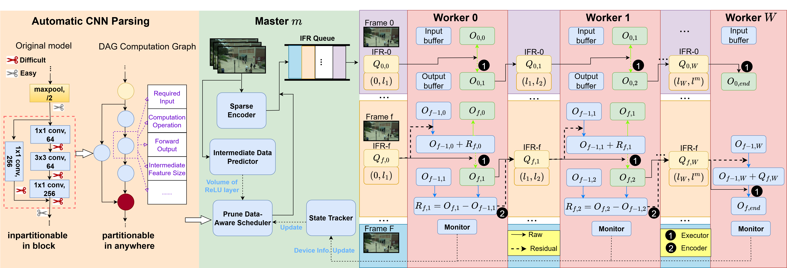

# Pao-Ding: Accelerating Cross-Edge Video Analytics via Automated CNN Model Partitioning
This repository is the official implementation of [Pao-Ding: Accelerating Cross-Edge Video Analytics via Automated CNN Model Partitioning (TMC 2025)](https://ieeexplore.ieee.org/abstract/document/11195759). 


<div align="center">
  
</div>


## Usage Introduction

The branch 'model_split' is the Automatic CNN Parsing module of Pao-Ding. You can apply it into other collaborative computing scenarios.

The branch 'paoding' is the all modules of Pao-Ding. You can run it for some experimental results.

## Environment Configuration

Python version 3.10.12.

Install Python dependencies:
```bash
pip3 install -r requirements.txt -i https://pypi.tuna.tsinghua.edu.cn/simple
```

## Network Configuration

### Topology Structure

Ensure the following device access paths are feasible, i.e., the client can access the corresponding server via a specific IP port.

| Device (client) | Device to be accessed (server) |
|-----------------|-------------------------------|
| Master          | All Workers, Trainer          |
| Worker i        | Worker i+1                    |

Although Worker also acts as a client requesting Master, this functionality is implemented internally by the system through gRPC streaming, so no additional configuration is required.

## Real Network Environment

### Operation
For specific running methods, you can refer to the [ResMap](https://github.com/nju-cn/ResMap) README.md. The main focus should be on the startup order of nodes in the topology structure and modifications to the `config.yml` file.

## Docker Simulation Environment

### Workflow
To support an arbitrary number of workers and different network bandwidths, we have implemented a collaborative inference simulation environment based on Docker containers on a server with 32 CPU cores and 64GB of memory. We can use Docker Compose to configure the resources (CPU and memory) used by each worker container node and simulate the network environment between containers using Pumba.

### Operation

#### Custom Configuration
You can refer to the `docker-compose.yml` file to modify the configuration and then start the Docker container nodes with customized resources:
```bash
docker build -t pao-ding .
docker compose up -d
```
You can then confirm whether the nodes are ready through health checks. If ready, you can use Pumba to set network bandwidth, latency, packet loss, etc.
```bash
pumba netem --duration 2m --tc-image gaiadocker/iproute2 rate --rate 32mbit re2:^pao-ding
```
The above script sets the bandwidth of container nodes starting with `pao-ding` to 32Mbps for a duration of 2 minutes. Then, you can enter the master-trainer node to start the master for final scheduling and pipeline inference:
```bash
docker exec -it pao-ding-paoding-master-trainer-1 /bin/bash
python3 main.py master
```
If the inference is completed, you can stop the containers using `docker-compose down`.

#### Auto-generated Configuration
You can use the `gen_compose_net.py` script to automatically generate the `temp_docker-compose.yml` and `net.yml` files:
```bash
python3 gen_compose_net.py <workers_num>
```
After generation, you need to copy the fields from the `net.yml` file to the corresponding fields in the `config.yml` file and remember to modify the `workers_num` field. Finally, you can start the container nodes with a custom number using:
```bash
docker-compose -f temp_docker-compose.yml up -d
```
For the remaining operations, you can refer to the custom configuration steps. Note that if container nodes fail to start, you may need to manually modify the resource allocation in the `temp_docker-compose.yml` file.

## Citation
If you find the paper provides some insights or our code useful, please consider giving a star ⭐ and citing:
```
@ARTICLE{11195759,
  author={Liang, Guanping and Han, Biao and Li, Ruidong and Han, Xueqiang and Sun, Zhigang},
  journal={IEEE Transactions on Mobile Computing}, 
  title={Pao-Ding: Accelerating Cross-Edge Video Analytics via Automated CNN Model Partitioning}, 
  year={2026},
  volume={25},
  number={3},
  pages={3697-3711},
  doi={10.1109/TMC.2025.3618296}}


```

This project mainly references the following three projects:

[ResMap](https://github.com/nju-cn/ResMap)

[Torch-Pruning](https://github.com/VainF/Torch-Pruning)

[Pumba](https://github.com/alexei-led/pumba)
